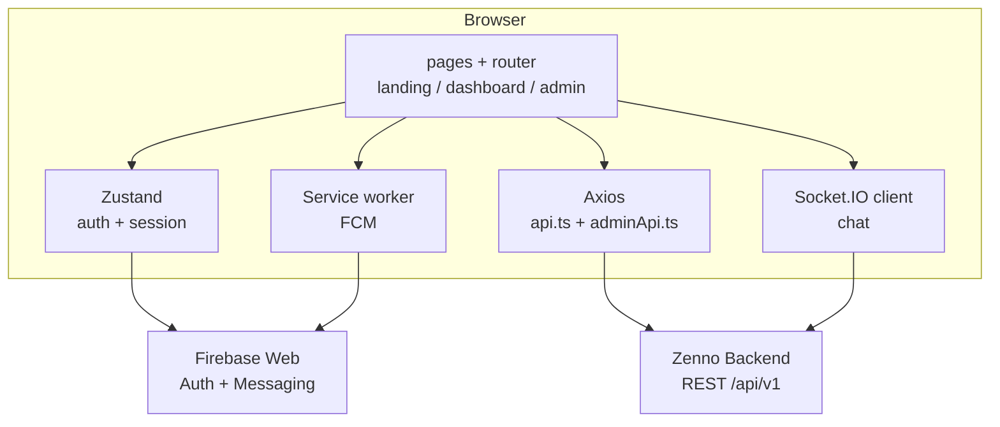

# Zenno Website

Zenno Website is the React + Vite frontend for the Zenno platform. It includes:

- Public marketing/landing pages
- Authenticated dashboard experience
- Firebase authentication integration
- Web push notifications (Firebase Cloud Messaging)
- Real-time chat via Socket.IO
- **Admin console** for operators (`/admin`, Firebase + `isAdmin`)

## Product Overview

Zenno is a developer productivity and wellbeing platform. The website is the primary user-facing surface where users:

- sign in and manage their account
- review personal productivity analytics
- explore coding behavior trends and skills growth
- manage projects and profile settings
- receive nudges and notifications from the Zenno ecosystem
- chat with peers inside the platform

The frontend is designed for two audiences:

- **New visitors**: landing pages communicate value proposition, product flow, and conversion paths
- **Registered users**: dashboard pages provide actionable analytics, progress insights, and account controls

## Core Features

### Public Website

- Marketing landing page with product sections, social proof, and CTAs
- Legal/info pages (privacy, terms, security)
- Entry points to authentication and app experience

### Authentication and Session

- Firebase-based sign-in and session handling
- Auth state persistence via client store
- Automatic backend token attachment for API calls
- Auth-aware routing and profile sync behaviors

### Analytics Dashboard Experience

- Key performance metrics (usage and behavior trends)
- Tool/app usage and language distribution visualizations
- Skills and projects insights with detail drill-down pages
- Project-level detail pages with update/delete actions

### Collaboration and Communication

- Peer discovery/search
- Public profile viewing
- In-app chat conversations and message threads (Socket.IO + REST)

### Notifications and Nudges

- In-app notifications center with unread counts and read-state actions
- Web push registration and delivery (Firebase Cloud Messaging)
- Zenno agent settings and nudge preference controls

### Admin console (operators)

Routes under **`/admin`** are a separate shell (sidebar + top bar) for workspace moderation and high-level stats. Access is **not** a separate password product: the same Firebase session as the main app is used, and the backend returns **403** unless the matching MongoDB user has **`isAdmin: true`**.

- **`/admin`** — dashboard: aggregate stats, verification / activity charts, paginated user table
- **`/admin/chat-reports`** — moderation queue with status filter and pagination
- **`/admin/chat-reports/:reportId`** — report detail, message preview, status transitions and admin note
- **`/admin/login`** — lightweight gate that redirects signed-in admins to `/admin` or sends others to sign-in

API calls use the shared Axios client (`src/services/api.ts`) and typed helpers in **`src/services/adminApi.ts`** (`/admin/stats`, `/admin/users`, `/admin/chat-reports`, …). Ensure `VITE_API_BASE_URL` resolves to a host that includes `/api/v1` (see that file’s base-URL normalization).

## Typical User Flow

1. User lands on marketing pages and signs in.
2. Frontend initializes Firebase auth and obtains an ID token.
3. API client sends authenticated requests to backend endpoints.
4. Dashboard loads metrics, trends, projects, and profile data.
5. User can manage settings, receive nudges/notifications, and chat with peers.

## Tech Stack

- React 18
- TypeScript
- Vite
- Zustand (auth/session state)
- Axios (API client)
- Firebase Web SDK (Auth + Messaging)
- Socket.IO client
- Radix UI + utility components

## Project Structure

- `src/components/landing` - public landing page sections and shared marketing UI
- `src/pages` - top-level route page components
- `src/components` - authenticated dashboard features and UI modules
- `src/services` - API client and typed API helpers (`adminApi.ts` for `/admin/*` REST)
- `src/pages/admin` - admin shell, dashboard, chat reports list/detail, login redirect
- `src/stores` - global client state (auth/session)
- `src/hooks` - reusable hooks (notifications, auth sync, etc.)
- `src/lib` - Firebase bootstrap and shared utilities
- `public` - static assets and service workers (`firebase-messaging-sw.js`)

## Frontend Architecture Notes

- **Routing**: SPA routing with client-side navigation and Vercel rewrite fallback.
- **State**: Zustand stores for auth/session and related UI behaviors.
- **Data fetching**: centralized Axios instance with interceptors for auth token injection and retry-on-401 behavior.
- **Realtime**: Socket.IO client for chat and selected live updates.
- **Notifications**: service worker + FCM for background/browser push delivery.



## Prerequisites

- Node.js 20+ recommended
- npm 10+ recommended
- Zenno backend API running locally or deployed
- Firebase project configured for web auth + FCM

## Local Setup

1. Install dependencies:

   ```bash
   npm install
   ```

2. Create local environment file:

   ```bash
   # macOS/Linux
   cp .env.example .env

   # Windows PowerShell
   Copy-Item .env.example .env
   ```

3. Fill required values in `.env`.

4. Start the dev server:

   ```bash
   npm run dev
   ```

Default Vite dev server runs on `http://localhost:3001`.

## Environment Variables

All frontend variables must use the `VITE_` prefix.

### Required

- `VITE_API_BASE_URL` - backend API base URL
- `VITE_FIREBASE_API_KEY`
- `VITE_FIREBASE_AUTH_DOMAIN`
- `VITE_FIREBASE_PROJECT_ID`
- `VITE_FIREBASE_STORAGE_BUCKET`
- `VITE_FIREBASE_MESSAGING_SENDER_ID`
- `VITE_FIREBASE_APP_ID`
- `VITE_FIREBASE_VAPID_KEY` - required for web push notifications

### Optional

- `VITE_FIREBASE_MEASUREMENT_ID` - Firebase Analytics
- `VITE_DESKTOP_AGENT_DOWNLOAD_URL` - when empty, hides download CTA on the agent page

## Available Scripts

- `npm run dev` - start local development server
- `npm run build` - create production build in `dist/`

## Build and Deploy

### Production Build

```bash
npm run build
```

Build output is generated in `dist/`.

### Vercel

This project includes `vercel.json` with:

- framework: `vite`
- output directory: `dist`
- SPA rewrite to `index.html` for client-side routing

## Security Best Practices

- Never commit `.env` files or secret values.
- Treat `.env.example` as placeholders only.
- Restrict Firebase project configuration with proper Auth settings and rules.
- Use least-privilege backend APIs; do not trust client-side authorization alone.
- Remove debugging logs that may expose user tokens or sensitive payloads.

## Troubleshooting

- **Blank page after deploy:** verify SPA rewrite is active (`vercel.json`).
- **Auth issues:** confirm all Firebase env values match the correct project.
- **Push notifications not working:** check `VITE_FIREBASE_VAPID_KEY`, browser notification permission, and service worker registration.
- **API 404s on dashboard endpoints:** ensure `VITE_API_BASE_URL` points to backend origin or `/api/v1` base.
- **Admin routes redirect to the main app:** backend rejected the session — confirm the user document has `isAdmin: true` and CORS allows your website origin.

---

Last Updated: 2026-05-01